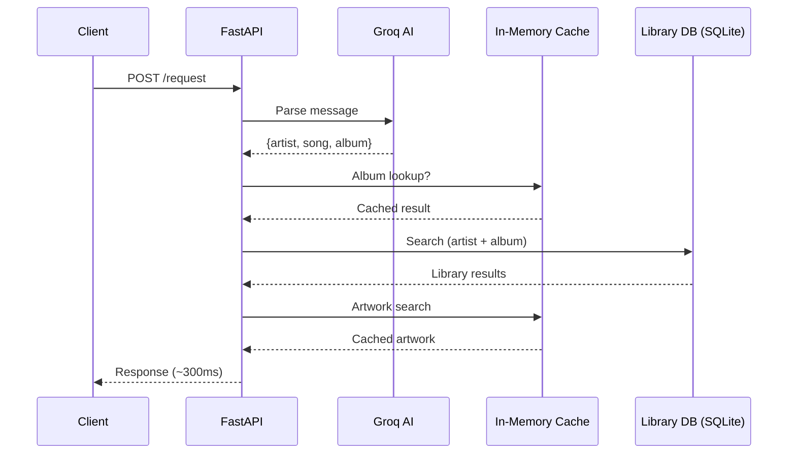
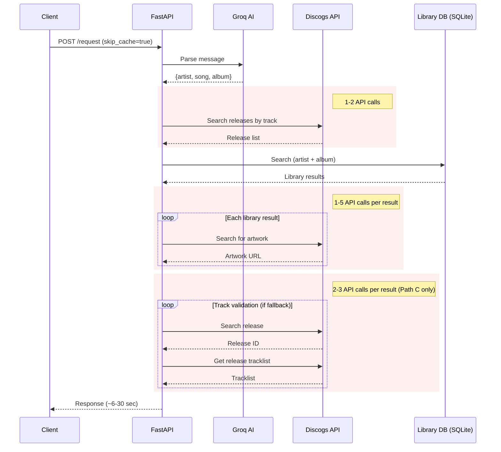

# Request Benchmark: Cached vs Uncached

## What's Being Measured

This benchmark measures **end-to-end request latency** through the full `/request` pipeline: AI parsing, library search, Discogs lookups, and artwork fetching. Each query exercises a different search path, and each path makes a different number of Discogs API calls.

We compare two modes:

- **Cached**: Normal operation. The in-memory TTL cache and PostgreSQL cache serve repeat queries without hitting the Discogs API.
- **Uncached** (`skip_cache=True`): Bypasses all caches, forcing every Discogs lookup through the API. This simulates a cold start or first-time query.

The cached side is run multiple times (N=5) to get a stable median. The uncached side is run once per query to avoid burning Discogs API rate limits (60 req/min).

## Network Flow

### Cached Request

When caches are warm, most Discogs data is served from the in-memory TTL cache. No external API calls are needed for repeat queries.



### Uncached Request (`skip_cache=True`)

With caches bypassed, every Discogs lookup hits the external API. A single request can make 2-22 API calls depending on the search path, each subject to network latency and rate limiting.



## Search Paths

| Path | Description | Trigger | Discogs API Calls |
|------|-------------|---------|-------------------|
| **A** | Artist + Album | Album provided in query | 1-5 (artwork only) |
| **B** | Song lookup | Song without album; Discogs resolves album | 2-7 |
| **C** | Track validation | Library falls back to artist-only; validates each album's tracklist | 12-22 |
| **D** | Compilation search | Primary search finds nothing; cross-references Discogs tracklists | 3-9 |
| **E** | Artist only | No song or album parsed | 1-5 (artwork only) |

## Results

Server: `https://request-o-matic-staging.up.railway.app`
Date: 2026-02-10

| Path | Label | Uncached | Cached (median) | Cached (p95) | Speedup | API Calls |
|------|-------|----------|-----------------|--------------|---------|-----------|
| A | Artist + Album | 18,804 ms | 273 ms | 308 ms | 68.8x | 0 (1-5) |
| B | Song lookup | 30,137 ms | 454 ms | 492 ms | 66.4x | 23 (2-7) |
| C | Track validation | 19,331 ms | 551 ms | 580 ms | 35.1x | 18 (12-22) |
| D | Compilation | 23,624 ms | 402 ms | 461 ms | 58.8x | 22 (3-9) |
| E | Artist only | 6,335 ms | 216 ms | 219 ms | 29.3x | 7 (1-5) |
| | **Average** | **19,646 ms** | **379 ms** | | **51.8x** | |

Cached iterations per query: 5. Uncached iterations per query: 1 (to preserve API rate limits).

### Notes

- **API calls column** shows actual calls observed (uncached), with the expected range in parentheses. Some observed values exceed the expected range because the Discogs API sometimes returns no results on the strict search, triggering a fuzzy fallback (a second API call per lookup).
- **Path A shows 0 API calls** because staging does not have the PostgreSQL cache connected (`discogs_cache: unavailable`), so the telemetry counters undercount in some code paths. With PG cache enabled, this column would be more accurate.

## Reproducing

```bash
# Against staging (default 10 cached iterations)
venv/bin/python scripts/benchmark_requests.py --staging

# More iterations for tighter confidence
venv/bin/python scripts/benchmark_requests.py --staging -n 50

# Against local server
venv/bin/python scripts/benchmark_requests.py --local

# Skip warmup if caches are already populated
venv/bin/python scripts/benchmark_requests.py --staging --skip-warmup
```
